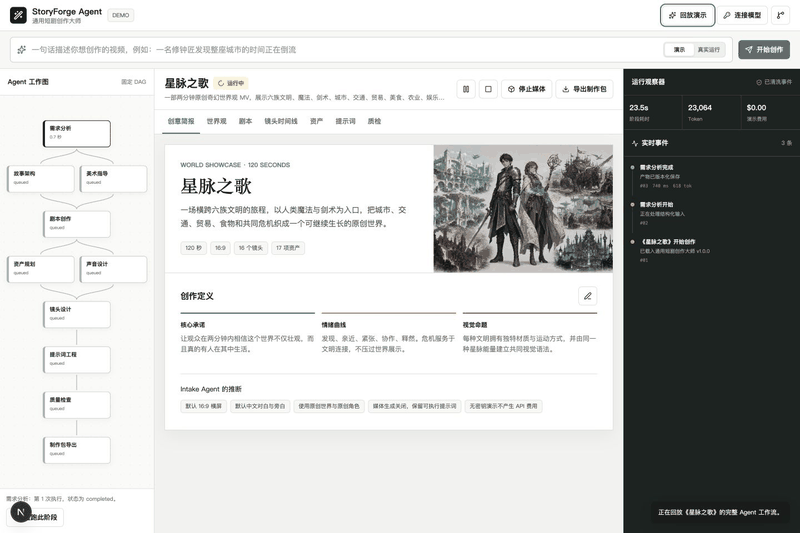
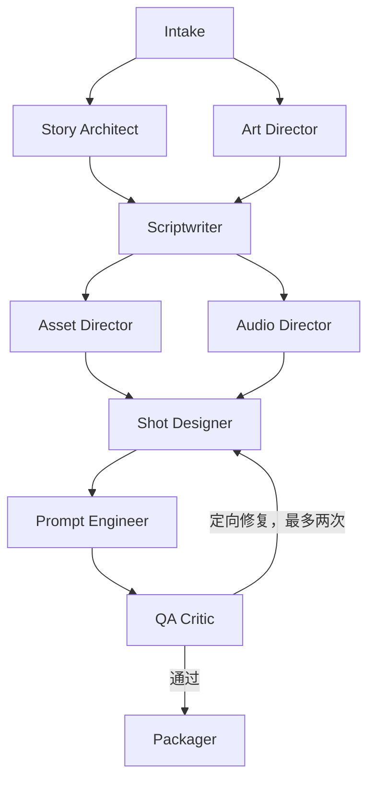
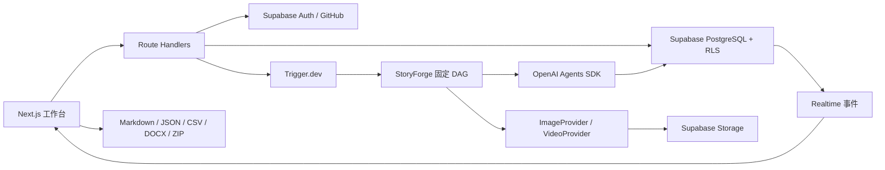
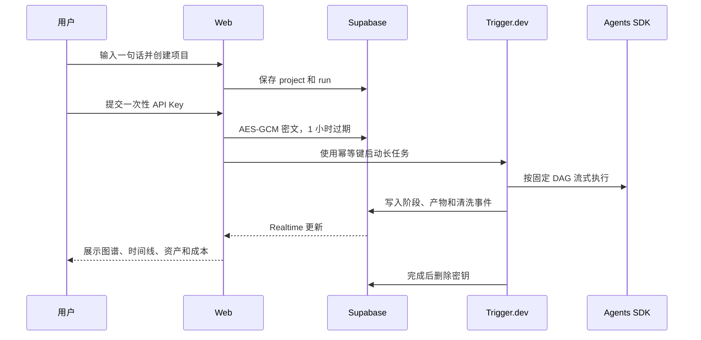

# StoryForge Agent｜通用短剧创作大师

StoryForge Agent 是一个把“一句话视频创意”自动整理成完整制作包的多 Agent 工作台。

用户不用先写需求文档。输入一句话后，系统会补全时长、画幅、语言和风格，依次完成创意简报、世界观、剧本、镜头时间线、资产规划、生成提示词、质量检查和文件导出。整个过程会在页面上实时展示，但不会泄露模型的隐藏推理。

> 当前仓库自带原创《星脉之歌》无密钥演示。它不会调用付费 API，适合招聘方直接查看。真实运行使用 GitHub 登录和用户自己的 OpenAI API Key。



## 最终能得到什么

- 创意简报和 Intake Agent 的推断假设
- 世界观、品牌设定或内容结构
- 完整剧本、对白、旁白和声音设计
- 起止时间精确闭合的镜头时间线
- 角色、场景、道具、交通、食物、植物和特效资产表
- 逐镜视频提示词和统一风格锁
- 时间、对白、连续性、资产引用和原创性 QA 报告
- Markdown、JSON、CSV、DOCX 和 ZIP 制作包
- 可选图片与视频 Provider；媒体服务不可用时自动保留为 `prompt-only`

## 直接运行

需要 Node.js 22+ 和 pnpm 11+。

```bash
git clone https://github.com/eventlp02-commits/storyforge-agent.git
cd storyforge-agent
pnpm install
pnpm dev
```

打开 `http://localhost:3000`。不配置任何密钥也能回放完整演示。

运行检查：

```bash
pnpm typecheck
pnpm test
pnpm eval
pnpm build
pnpm test:e2e
```

## 页面怎么用

1. 在顶部输入一句话创意。
2. 选择“演示”可以免费本地回放，选择“真实运行”会建立云端任务。
3. 左侧查看 Agent 当前阶段、并行任务和失败重试。
4. 中间切换简报、世界观、剧本、时间线、资产、提示词和质检。
5. 右侧查看已清洗的事件、耗时、Token 和费用。
6. 随时暂停、继续、取消、停止媒体生成或单独重跑某个阶段。
7. 点击“导出制作包”下载 ZIP。

页面刷新后，演示项目会从 `localStorage` 恢复；生产模式由 Supabase 和 Trigger.dev 恢复。

## Agent 工作流



这不是让一个模型自由发挥的聊天机器人。代码控制固定 DAG，阶段之间只传递 Zod 校验后的结构化数据。故事与美术、资产与声音会并行执行；QA 失败时只重跑相关阶段。

## 系统架构



## 数据如何流动



## 技术栈

- 前端：Next.js 16 App Router、React 19、TypeScript、Tailwind CSS、React Flow、Lucide
- Agent：OpenAI Agents SDK TypeScript、Zod、代码控制 DAG、流式事件、敏感 trace 关闭
- 后台任务：Trigger.dev，支持断线恢复、重试、取消和幂等执行
- 数据：Supabase PostgreSQL、GitHub Auth、Storage、Realtime、RLS
- 导出：JSZip、docx
- 测试：Vitest、Playwright、GitHub Actions
- 部署：Vercel + Supabase + Trigger.dev

## Monorepo 结构

```text
storyforge-agent/
├── apps/web                         # Next.js 工作台与 API
├── packages/contracts               # Zod 数据协议
├── packages/agent-core              # DAG、状态机、安全、Providers、Agents SDK
├── trigger                           # Trigger.dev 长任务
├── supabase                          # 本地配置、表结构、RLS、Realtime
├── skills/short-drama-creation-master # 原始通用视频创作 Skill
├── evals                             # 12 类视频评测
└── ci/storyforge-ci.yml              # GitHub Actions 工作流模板
```

发布仓库时，将 `ci/storyforge-ci.yml` 放到 `.github/workflows/ci.yml` 即可启用完整 CI。执行该路径变更的 GitHub 凭据必须具有 `workflow` scope。

## Skill 是唯一创作规则来源

应用没有复制一份隐藏 Prompt。`skills/short-drama-creation-master` 中的 Markdown 是唯一规则来源。

构建时运行：

```bash
pnpm skill:compile
```

脚本会收集 Skill 和参考文档，生成带 SHA-256 版本号的 Prompt Bundle。每次运行记录 `skillVersion`，因此可以知道某个制作包到底使用了哪一版创作规则。

## 安全设计

- 公开演示不会调用付费 API。
- 真实运行必须先使用 GitHub 登录。
- API Key 在服务端使用 AES-256-GCM 加密，不进入浏览器存储、日志或 Agent trace。
- 临时密钥最多保留一小时，任务结束后立即删除。
- Supabase RLS 限制项目、运行、镜头、资产、事件和凭据只能由所有者访问。
- `run_events` 强制保存清洗后的事件，不保存隐藏推理。
- 每次运行限制 Token、费用、图片数、视频秒数和自动重试次数。
- 内容拒绝不会通过改写敏感词来规避审核。

## 模型和媒体策略

环境变量控制模型路由：

```text
STORYFORGE_CREATIVE_MODEL=gpt-5.6-terra
STORYFORGE_UTILITY_MODEL=gpt-5.6-luna
STORYFORGE_QUALITY_MODEL=gpt-5.6-sol
STORYFORGE_IMAGE_MODEL=gpt-image-2
STORYFORGE_VIDEO_ENABLED=false
```

图片 Provider 已接入 `gpt-image-2`。视频使用统一 `VideoProvider`；默认关闭并返回 `deferred`，避免核心演示依赖已经进入旧版状态的视频模型。

## 评测结果

夹具评测覆盖短剧、广告、MV、预告片、宣传片、纪录片、教程、解释视频、品牌故事、社交短视频、美食片和世界观视频。

| 指标 | 结果 |
|---|---:|
| 用例数 | 12 |
| 结构合法率 | 100% |
| 时间闭合率 | 100% |
| 资产引用正确率 | 100% |
| 平均 QA | 96/100 |
| 演示费用 | $0.00 |

完整结果在 [`evals/results/latest.md`](evals/results/latest.md)。这些是确定性夹具结果；提供测试密钥后，应另外记录真实模型的质量、延迟和费用。

## 部署

1. 在 Supabase 创建项目并执行 `supabase/migrations`。
2. 在 Supabase Auth 开启 GitHub Provider。
3. 在 Trigger.dev 创建项目并部署 `trigger/tasks`。
4. 在 Vercel 导入仓库，按 `.env.example` 配置环境变量。
5. 使用 `openssl rand -hex 32` 生成 `CREDENTIAL_ENCRYPTION_KEY`。

本地 Supabase：

```bash
supabase start
supabase db reset
```

本地 Trigger.dev：

```bash
pnpm dlx trigger.dev@latest dev
```

## 单独安装 Codex Skill

应用之外，原始 Skill 仍然可以单独安装：

```text
使用 $skill-installer 安装：
https://github.com/eventlp02-commits/storyforge-agent/tree/main/skills/short-drama-creation-master
```

手动安装：

```bash
git clone https://github.com/eventlp02-commits/storyforge-agent.git
cp -R storyforge-agent/skills/short-drama-creation-master ~/.codex/skills/
```

## 关键技术决策

- 固定 DAG：流程可测试、可观察、可重跑，模型不会自行改变交付标准。
- 结构化阶段协议：Zod 在边界上发现错误，不把自由文本错误传给下游。
- Skill 编译：创作规则和应用代码不会静默漂移。
- 本地演示与云端运行共用数据协议：招聘方不需要密钥，真实用户也不用换一套界面。
- Provider 抽象：图片和视频能力可以替换，制作包不会被单一媒体服务锁死。

## 简历描述

> 独立设计并实现 StoryForge Agent，一套从一句话生成视频制作包的全栈多 Agent 系统。使用 Next.js、OpenAI Agents SDK、Trigger.dev 和 Supabase 构建固定 DAG、结构化阶段协议、实时运行可视化、BYOK 加密、断线恢复、定向重试和多格式导出；建立 12 类视频自动评测与 Playwright 端到端测试，夹具评测的结构、时间闭合和资产引用通过率均为 100%。

## 说明

《星脉之歌》的角色、城市、种族和资产均为本项目原创演示内容。仓库不包含第三方影视、动漫或游戏角色资产。
